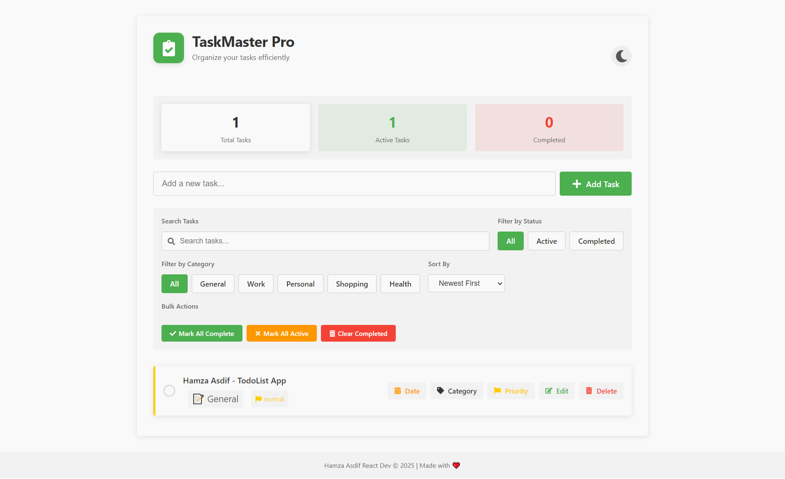

# Modern TodoList App

A sleek, feature-rich task management application built with React and Material UI, designed to help you organize your daily tasks efficiently.





## 🌟 Features

### Task Management
- **Create, Edit, Delete Tasks**: Easily manage your to-do items
- **Task Completion**: Mark tasks as completed with a simple click
- **Task Prioritization**: Set priority levels (High, Normal, Low) for your tasks
- **Task Categorization**: Organize tasks into categories (Work, Personal, Shopping, Health, General)
- **Due Dates**: Set and track deadlines for your tasks

### User Interface
- **Dark/Light Mode**: Toggle between dark and light themes based on your preference
- **Responsive Design**: Works seamlessly on desktop, tablet, and mobile devices
- **Animated Transitions**: Smooth animations for a polished user experience
- **Intuitive Controls**: User-friendly interface with clear visual indicators

### Advanced Features
- **Task Filtering**: Filter tasks by status (All, Active, Completed)
- **Category Filtering**: View tasks from specific categories
- **Search Functionality**: Find tasks quickly with the search feature
- **Sort Options**: Sort tasks by date (newest/oldest) or alphabetically
- **Bulk Actions**: Mark all tasks as completed/active or delete all completed tasks
- **Statistics Dashboard**: View task completion statistics

### Data Management
- **Local Storage**: Tasks persist between sessions using browser localStorage
- **Data Validation**: Prevents empty or duplicate tasks

## 🚀 Getting Started

### Prerequisites
- Node.js (v14.0.0 or higher)
- npm (v6.0.0 or higher)

### Installation

1. Clone the repository:
```bash
git clone https://github.com/hamza-asdif/modern-todolist-app.git
cd modern-todolist-app
```

2. Install dependencies:
```bash
cd todolist-app
npm install
```

3. Start the development server:
```bash
npm run dev
```

4. Open your browser and navigate to:
```
http://localhost:5173
```

## 🛠️ Built With

- [React](https://reactjs.org/) - Frontend library
- [Vite](https://vitejs.dev/) - Build tool
- [Material UI](https://mui.com/) - UI component library
- [React Icons](https://react-icons.github.io/react-icons/) - Icon library
- [Alertify.js](https://alertifyjs.com/) - Notification and dialog library

## 📱 Mobile Support

The app is fully responsive and works on all device sizes:
- Desktop
- Tablet
- Mobile phones

## 🎨 Customization

You can customize the app by modifying:
- Color schemes in `App.css` (variables in `:root`)
- Task categories in `App.jsx`
- UI components in respective component files

## 🔍 Project Structure

```
todolist-app/
├── public/
│   └── assets/
├── src/
│   ├── components/
│   │   ├── AddTask/
│   │   ├── HeaderTitle/
│   │   └── Statistics/
│   ├── context/
│   ├── App.css
│   ├── App.jsx
│   ├── main.jsx
│   └── index.css
├── index.html
└── package.json
```

## 🤝 Contributing

Contributions, issues, and feature requests are welcome! Feel free to check the [issues page](https://github.com/hamza-asdif/modern-todolist-app/issues).

## 📝 License

This project is licensed under the MIT License - see the LICENSE file for details.

## 🙏 Acknowledgements

- [React Documentation](https://reactjs.org/docs/getting-started.html)
- [Material UI Documentation](https://mui.com/getting-started/usage/)
- [Alertify.js Documentation](https://alertifyjs.com/guide.html)
